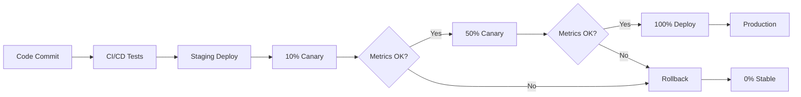

# Deployment Guide

## 🚀 Progressive Canary Deployment

Mission Control uses progressive canary deployments to ensure zero-downtime releases with automatic rollback capabilities.

## 📊 Deployment Strategy



## 🎯 Canary Deployment Schedule

### Standard 3-Day Progression

| Day | Stage | Traffic | Duration | Validation |
|-----|-------|---------|----------|------------|
| 1 | Initial | 10% | 24 hours | P95 < 500ms, Errors < 1% |
| 2 | Ramp | 50% | 24 hours | P95 < 500ms, Errors < 1% |
| 3 | Full | 100% | Permanent | All metrics stable |

### Fast-Track (Critical Fixes)

| Hour | Stage | Traffic | Validation |
|------|-------|---------|------------|
| 0-1 | Initial | 10% | Basic health |
| 1-2 | Ramp | 50% | Error rate |
| 2+ | Full | 100% | Full validation |

## 🔧 Using the Canary Script

### Basic Commands

```bash
# Start canary deployment (10%)
./scripts/canary-ramp.sh staging 10

# Progress to 50%
./scripts/canary-ramp.sh staging 50

# Full deployment (100%)
./scripts/canary-ramp.sh staging 100

# Emergency rollback
./scripts/canary-ramp.sh production 0
```

### Script Features

- ✅ Automatic metrics collection
- ✅ P95 latency testing (100 requests)
- ✅ Error rate monitoring
- ✅ Color-coded output
- ✅ Rollback on failure

### Example Output

```
🚀 Ghost Recon Canary Ramp Controller
================================
📊 Stage 1: 10% Canary Deployment
Setting canary to 10% in staging...
✅ Canary updated to 10%
Checking metrics...
✅ Heartbeat OK - Response time: 0.125s
  Errors: 5/1000 (0.50%)
  P50 Latency: 25ms
  P99 Latency: 150ms
Running P95 latency test (100 requests)...
P95 Latency: 287.453ms
Stage 1 complete. Monitor for 24 hours before proceeding.
```

## 📋 Deployment Checklist

### Pre-Deployment

- [ ] All tests passing in CI
- [ ] Security scan complete
- [ ] Changelog updated
- [ ] Version bumped
- [ ] Rollback checkpoint created

```bash
# Create rollback checkpoint
curl -X POST https://api.mission-control.com/api/ghost/rollback \
  -H "Authorization: Bearer $OPS_TOKEN" \
  -d '{"note":"pre-v0.5.0-deployment"}'
```

### During Deployment

- [ ] Monitor PagerDuty alerts
- [ ] Watch error rates
- [ ] Check P95 latency
- [ ] Verify signature generation
- [ ] Test critical paths

### Post-Deployment

- [ ] Verify all endpoints
- [ ] Check audit logs
- [ ] Update status page
- [ ] Notify stakeholders
- [ ] Document any issues

## 🔄 Deployment Workflows

### Feature Release

```bash
# 1. Create feature branch
git checkout -b feature/new-feature

# 2. Develop and test
npm test

# 3. Create PR
gh pr create --title "feat: new feature"

# 4. Merge to main (auto-deploys to staging)
gh pr merge

# 5. Start canary in staging
./scripts/canary-ramp.sh staging 10

# 6. Monitor for 24 hours
# Check metrics at https://mission-control-hq-staging.utahj4754.workers.dev/api/ghost/heartbeat

# 7. Progress canary
./scripts/canary-ramp.sh staging 50
# Wait 24 hours
./scripts/canary-ramp.sh staging 100

# 8. Tag for production
git tag v0.5.0
git push origin v0.5.0

# 9. Production canary
./scripts/canary-ramp.sh production 10
```

### Hotfix Deployment

```bash
# 1. Create hotfix branch from production
git checkout -b hotfix/critical-fix tags/v0.4.1

# 2. Apply fix and test
npm test

# 3. Direct production deployment
git tag v0.4.2-hotfix
git push origin v0.4.2-hotfix

# 4. Fast canary (1 hour per stage)
./scripts/canary-ramp.sh production 10
# Monitor for 1 hour
./scripts/canary-ramp.sh production 50
# Monitor for 1 hour
./scripts/canary-ramp.sh production 100
```

### Rollback Procedure

```bash
# 1. Immediate canary disable
./scripts/canary-ramp.sh production 0

# 2. Check previous deployment
wrangler deployments list --env production

# 3. Rollback to previous version
wrangler rollback --env production --message "Emergency rollback"

# 4. Verify rollback
curl -s https://api.mission-control.com/api/ghost/heartbeat | jq '.heartbeat.deployment'

# 5. Create incident report
gh issue create --title "[INCIDENT] Rollback from v0.5.0" \
  --body "Rolled back due to [issue description]"
```

## 📈 Metrics Monitoring

### Key Metrics to Watch

| Metric | Healthy | Warning | Critical | Action |
|--------|---------|---------|----------|--------|
| P50 Latency | < 50ms | 50-100ms | > 100ms | Investigate |
| P95 Latency | < 500ms | 500-750ms | > 750ms | Rollback |
| P99 Latency | < 1000ms | 1000-1500ms | > 1500ms | Rollback |
| Error Rate | < 0.1% | 0.1-1% | > 1% | Rollback |
| Success Rate | > 99.9% | 99-99.9% | < 99% | Rollback |

### Monitoring Commands

```bash
# Real-time metrics
watch -n 5 'curl -s https://api.mission-control.com/api/ghost/heartbeat | jq .heartbeat.metrics'

# P95 latency test
for i in {1..100}; do
  curl -w "%{time_total}\n" -o /dev/null -s https://api.mission-control.com/api/health
done | sort -n | awk 'NR==95{print "P95: " $1 * 1000 "ms"}'

# Error rate calculation
curl -s https://api.mission-control.com/api/ghost/heartbeat | \
  jq '.heartbeat.metrics | .errors / .requests * 100'

# Canary traffic verification
curl -I https://api.mission-control.com/api/health | grep X-Canary
```

## 🎛️ Canary Configuration

### Environment Variables

```toml
# wrangler.toml
[env.staging.vars]
CANARY_PERCENT = "10"  # Default canary percentage

[env.production.vars]
CANARY_PERCENT = "0"   # Production starts at 0%
```

### Dynamic Updates

```bash
# Update canary percentage via KV
echo "25" | wrangler kv:key put CANARY_PERCENT \
  --env production \
  --binding DEAD_MAN_FUSE

# Read current percentage
wrangler kv:key get CANARY_PERCENT \
  --env production \
  --binding DEAD_MAN_FUSE
```

### Traffic Routing Logic

```typescript
// How canary routing works
function shouldServeCanary(request: Request): boolean {
  const percent = parseInt(env.CANARY_PERCENT || '0');
  if (percent === 0) return false;
  if (percent === 100) return true;
  
  // Consistent routing based on IP
  const ip = request.headers.get('CF-Connecting-IP');
  const hash = simpleHash(ip);
  return (hash % 100) < percent;
}
```

## 🔐 Security During Deployment

### Secret Rotation

```bash
# Pre-deployment secret rotation
openssl rand -hex 32 | wrangler secret put JWT_SECRET --env staging

# Verify new secret works
curl -H "Authorization: Bearer [new-token]" \
  https://mission-control-hq-staging.utahj4754.workers.dev/api/health

# Roll out to production
openssl rand -hex 32 | wrangler secret put JWT_SECRET --env production
```

### Signature Validation

```bash
# Ensure signatures are valid during deployment
./scripts/validate-signatures.sh

# Check signature on canary traffic
curl -s https://api.mission-control.com/api/ghost/heartbeat | \
  jq -e '.verified == true' || echo "SIGNATURE INVALID!"
```

## 🚨 Incident Management

### Deployment Failures

| Issue | Detection | Resolution | Prevention |
|-------|-----------|------------|------------|
| High latency | P95 > 500ms | Rollback, optimize | Load testing |
| Increased errors | Rate > 1% | Rollback, fix bugs | Better testing |
| Auth failures | 401/403 spike | Check secrets | Secret validation |
| Memory issues | OOM errors | Rollback, profile | Memory limits |

### Automated Rollback Triggers

```javascript
// Automatic rollback conditions
if (errorRate > 5) {
  await rollback('Error rate exceeded 5%');
}

if (p95Latency > 1000) {
  await rollback('P95 latency exceeded 1 second');
}

if (signatureValidation === false) {
  await rollback('Signature validation failed');
}
```

## 📊 Deployment Analytics

### Success Metrics

```bash
# Calculate deployment success rate
DEPLOYMENTS=$(wrangler deployments list --env production | wc -l)
ROLLBACKS=$(git log --grep="rollback" --oneline | wc -l)
SUCCESS_RATE=$((($DEPLOYMENTS - $ROLLBACKS) * 100 / $DEPLOYMENTS))
echo "Deployment success rate: ${SUCCESS_RATE}%"
```

### Performance Impact

```bash
# Compare before/after metrics
# Before deployment
curl -s https://api.mission-control.com/api/ghost/heartbeat | \
  jq '.heartbeat.metrics' > before.json

# After deployment
curl -s https://api.mission-control.com/api/ghost/heartbeat | \
  jq '.heartbeat.metrics' > after.json

# Compare
diff before.json after.json
```

## 🔧 Advanced Deployment

### Blue-Green Deployment

```bash
# Deploy to green environment
wrangler deploy --env green

# Test green environment
./scripts/validate-deployment.sh green

# Switch traffic
wrangler publish --env production --route "api.mission-control.com/*"
```

### Multi-Region Deployment

```bash
# Deploy to multiple regions
REGIONS=("us-east-1" "eu-west-1" "ap-southeast-1")

for REGION in "${REGIONS[@]}"; do
  REGION_ID=$REGION wrangler deploy --env production
  echo "Deployed to $REGION"
done
```

### Feature Flags

```typescript
// Feature flag implementation
const features = {
  newAuth: env.CANARY_PERCENT > 50,
  betaAPI: env.FEATURE_BETA_API === 'true',
  v2Routes: env.DEPLOYMENT_ID.includes('v2')
};

if (features.newAuth) {
  // Use new authentication
}
```

## 📚 Resources

- [Cloudflare Workers Deployments](https://developers.cloudflare.com/workers/platform/deployments/)
- [Progressive Delivery](https://www.progressivedelivery.io/)
- [Canary Deployments Best Practices](https://martinfowler.com/bliki/CanaryRelease.html)
- [SRE Book - Canarying](https://sre.google/sre-book/canarying-releases/)

---

*Last Updated: v0.4.1 | Progressive Canary System Active*