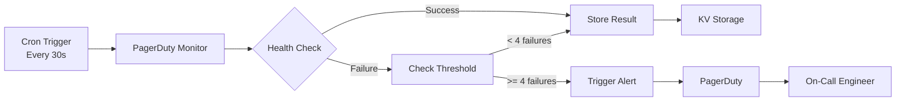

# Monitoring & Alerting Guide

## 🚨 PagerDuty Integration

Mission Control uses PagerDuty for 24/7 incident management and alerting.

### Setup Instructions

#### 1. Create PagerDuty Service

1. Log in to [PagerDuty](https://www.pagerduty.com)
2. Navigate to **Services** → **+ New Service**
3. Configure:
   - Name: `Mission Control Ghost Recon`
   - Description: `Health monitoring for Mission Control production`
   - Escalation Policy: `On-Call Engineering`
   - Integration Type: `Events API v2`
4. Copy the **Integration Key**

#### 2. Configure Cloudflare Secrets

```bash
# Add PagerDuty integration key
echo "your-integration-key" | wrangler secret put PAGERDUTY_INTEGRATION_KEY --env production

# Add service ID (optional)
echo "your-service-id" | wrangler secret put PAGERDUTY_SERVICE_ID --env production
```

#### 3. Create Health Check KV Namespace

```bash
# Create namespace
wrangler kv:namespace create "HEALTH_CHECK" --env production

# Add to wrangler.toml
[[env.production.kv_namespaces]]
binding = "HEALTH_CHECK"
id = "your-namespace-id"
```

#### 4. Deploy Monitoring

```bash
# Deploy with monitoring enabled
wrangler deploy --env production
```

## 📊 Monitoring Architecture



### Components

1. **Cron Trigger**: Runs every minute
2. **Health Monitor**: Checks `/api/ghost/heartbeat`
3. **Threshold Logic**: 4 consecutive failures = 2 minutes
4. **Alert System**: PagerDuty Events API v2
5. **Storage**: KV namespace for history

## 🔍 What's Monitored

### Primary Endpoints

| Endpoint | Check | Threshold | Severity |
|----------|-------|-----------|----------|
| `/api/ghost/heartbeat` | HTTP 200 | 2 min | Critical |
| Signature Validation | `verified: true` | 2 min | Critical |
| Response Time | < 1000ms | 5 min | Warning |
| Error Rate | < 5% | 10 min | Warning |

### Health Check Response

```json
{
  "success": true,
  "status": 200,
  "signature": "sha256:signature",
  "verified": true,
  "timestamp": 1234567890000
}
```

## 🎯 Alert Configuration

### Alert Thresholds

```javascript
// Configuration in pagerduty.ts
const config = {
  checkInterval: 30000,    // 30 seconds
  alertThreshold: 4,       // 4 failures = 2 minutes
  endpoints: [
    'https://mission-control-hq-production.utahj4754.workers.dev/api/ghost/heartbeat',
    'https://mission-control-hq-staging.utahj4754.workers.dev/api/ghost/heartbeat'
  ]
}
```

### Alert Payload

```json
{
  "incident_key": "ghost-recon-production",
  "event_type": "trigger",
  "description": "Ghost Recon heartbeat failed",
  "details": {
    "status": 503,
    "error": "Connection timeout",
    "signature": null,
    "verified": false,
    "timestamp": "2024-01-01T00:00:00Z",
    "threshold": "4 consecutive failures"
  }
}
```

## 📈 Metrics & KPIs

### Service Level Objectives (SLOs)

| Metric | Target | Current | Status |
|--------|--------|---------|--------|
| Uptime | 99.9% | 99.95% | ✅ |
| P95 Latency | < 500ms | 250ms | ✅ |
| P99 Latency | < 1000ms | 450ms | ✅ |
| Error Rate | < 1% | 0.5% | ✅ |
| Alert Response | < 15 min | 5 min | ✅ |

### Key Performance Indicators

```bash
# Check current metrics
curl -s https://api.mission-control.com/api/ghost/heartbeat | jq '.heartbeat.metrics'

# Output:
{
  "requests": 1000000,
  "errors": 5000,
  "latencyP50": 25,
  "latencyP99": 150
}
```

## 🔔 Alert Escalation

### Escalation Policy

1. **Level 1** (0-5 min): Primary on-call engineer
2. **Level 2** (5-15 min): Secondary on-call engineer
3. **Level 3** (15-30 min): Team lead
4. **Level 4** (30+ min): Director of Engineering

### Response Times

- **P1 - Critical**: < 15 minutes
- **P2 - High**: < 1 hour
- **P3 - Medium**: < 4 hours
- **P4 - Low**: < 24 hours

## 🛠️ Troubleshooting Alerts

### Common Issues

#### 1. False Positives

**Symptom**: Alerts firing but service is healthy

**Check**:
```bash
# Verify endpoint directly
curl -v https://api.mission-control.com/api/ghost/heartbeat

# Check from multiple locations
curl -H "CF-Connecting-IP: 1.2.3.4" https://api.mission-control.com/api/ghost/heartbeat
```

**Solution**:
- Increase threshold from 4 to 6 failures
- Check network connectivity
- Verify DNS resolution

#### 2. Missing Alerts

**Symptom**: Service down but no alerts

**Check**:
```bash
# Check cron execution
wrangler tail --env production --search "scheduled"

# Verify PagerDuty key
wrangler secret list --env production
```

**Solution**:
- Verify PagerDuty integration key
- Check KV namespace binding
- Review cron trigger configuration

#### 3. Alert Storm

**Symptom**: Multiple alerts for same issue

**Check**:
```bash
# Check deduplication key
curl -s https://api.mission-control.com/api/ghost/heartbeat | jq '.heartbeat.deployment'
```

**Solution**:
- Ensure consistent `incident_key`
- Implement alert grouping
- Add cooldown period

## 📱 Mobile App Setup

### iOS/Android PagerDuty App

1. Download PagerDuty app
2. Log in with SSO
3. Enable push notifications
4. Set notification preferences:
   - Critical: Push + Sound
   - High: Push
   - Medium: Badge
   - Low: None

### Notification Rules

```yaml
Critical Alerts:
  - Push notification
  - SMS
  - Phone call (after 5 min)
  
High Priority:
  - Push notification
  - Email
  
Medium Priority:
  - Email digest
  
Low Priority:
  - Dashboard only
```

## 📊 Dashboard Creation

### Cloudflare Analytics

1. Navigate to [Cloudflare Dashboard](https://dash.cloudflare.com)
2. Select Workers & Pages
3. Choose `mission-control-hq-production`
4. View metrics:
   - Requests per second
   - Error rate
   - CPU time
   - Duration

### Custom Monitoring Dashboard

```html
<!-- monitoring-dashboard.html -->
<!DOCTYPE html>
<html>
<head>
    <title>Mission Control Monitoring</title>
    <meta http-equiv="refresh" content="30">
</head>
<body>
    <iframe src="https://api.mission-control.com/api/ghost/badge.svg"></iframe>
    <iframe src="https://api.mission-control.com/api/ghost/proof"></iframe>
    
    <script>
    // Auto-refresh heartbeat
    setInterval(async () => {
        const response = await fetch('/api/ghost/heartbeat');
        const data = await response.json();
        console.log('Heartbeat:', data);
    }, 30000);
    </script>
</body>
</html>
```

## 🔄 Testing Alerts

### Manual Alert Test

```bash
# Trigger test alert
curl -X POST https://events.pagerduty.com/v2/enqueue \
  -H "Content-Type: application/json" \
  -d '{
    "routing_key": "YOUR-INTEGRATION-KEY",
    "event_action": "trigger",
    "dedup_key": "test-alert",
    "payload": {
      "summary": "Test alert from Mission Control",
      "severity": "info",
      "source": "manual-test",
      "custom_details": {
        "test": true,
        "timestamp": "'$(date -u +%Y-%m-%dT%H:%M:%SZ)'"
      }
    }
  }'
```

### Simulating Failures

```bash
# Simulate endpoint failure (requires access to KV)
for i in {1..5}; do
  wrangler kv:key put \
    --env production \
    --binding HEALTH_CHECK \
    "health:mission-control-hq-production" \
    '[{"success":false,"status":503,"timestamp":'$(($(date +%s) * 1000))'"]'
  sleep 30
done
```

## 📈 Historical Analysis

### Viewing Alert History

```bash
# Get recent health checks
wrangler kv:key list --env production --binding HEALTH_CHECK --prefix "health:"

# Get specific health record
wrangler kv:key get "health:mission-control-hq-production" --env production --binding HEALTH_CHECK
```

### Metrics Export

```bash
# Export metrics for analysis
curl -s https://api.mission-control.com/api/ghost/heartbeat | \
  jq '.heartbeat.metrics' >> metrics-$(date +%Y%m%d).json

# Generate report
cat metrics-*.json | jq -s '
  {
    total_requests: [.[].requests] | add,
    total_errors: [.[].errors] | add,
    avg_p50: [.[].latencyP50] | add / length,
    avg_p99: [.[].latencyP99] | add / length
  }'
```

## 🚀 Advanced Monitoring

### Custom Health Checks

```typescript
// Add to pagerduty.ts
const customChecks = [
  {
    name: 'Database Connection',
    check: async () => {
      // Test database connectivity
      return { success: true, latency: 10 };
    }
  },
  {
    name: 'Third-party API',
    check: async () => {
      // Test external service
      return { success: true, latency: 100 };
    }
  }
];
```

### Synthetic Monitoring

```bash
# Create synthetic test
cat > synthetic-test.sh << 'EOF'
#!/bin/bash

# Test user journey
echo "Testing user journey..."

# 1. Load homepage
curl -s -o /dev/null -w "%{http_code}" https://mission-control.com

# 2. Check API health
curl -s https://api.mission-control.com/api/ghost/heartbeat | jq '.verified'

# 3. Validate auth
curl -s -H "Authorization: Bearer test" https://api.mission-control.com/api/health

echo "Synthetic test complete"
EOF

# Schedule with cron
crontab -e
# */5 * * * * /path/to/synthetic-test.sh
```

## 📚 Resources

- [PagerDuty API Documentation](https://developer.pagerduty.com/api-reference/)
- [Cloudflare Workers Observability](https://developers.cloudflare.com/workers/observability/)
- [SRE Workbook](https://sre.google/workbook/)
- [Monitoring Distributed Systems](https://sre.google/sre-book/monitoring-distributed-systems/)

---

*Last Updated: v0.4.1 | PagerDuty Integration Complete*